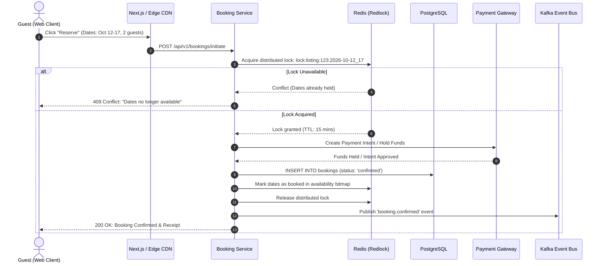

```
# Production-Scale Vacation Rental Marketplace Architecture
```

```
This document describes the high-availability, globally distributed architecture
designed to power a production-scale vacation-rental marketplace handling
millions of listings, concurrent searches, and real-time reservation
transactions.
```

```
## 1. System Architecture Diagram
```

```
```mermaid
flowchart TB
    subgraph ClientLayer [Client & Edge CDN]
        User[Desktop / Mobile Client]
        CF[Cloudflare Edge Network / Anycast DNS / WAF / DDoS Protection]
        User -->|HTTPS / HTTP3| CF
    end
    subgraph PresentationLayer [Frontend Presentation Layer]
        NextApp[Next.js App Router Cluster]
        SSR[Server-Side Rendering / ISR Engine]
        NextApp --- SSR
        CF -->|Edge Cache Miss| NextApp
    end
    subgraph GatewayLayer [API Gateway & Routing]
        APIGW[Kong / Envoy API Gateway]
        RateLimiter[Token Bucket Rate Limiter]
        AuthService[Auth0 / JWT Token Verifier]
        NextApp -->|GraphQL / gRPC / REST| APIGW
        APIGW --- RateLimiter
        APIGW --- AuthService
    end
    subgraph Microservices [Core Microservice Plane]
        SearchService[Search & Discovery Service]
        BookingService[Booking & Checkout Orchestrator]
        PricingEngine[Dynamic Pricing & Availability Engine]
        HostService[Host & Inventory Management]
        ReviewService[Reviews & Reputation Service]
        APIGW --> SearchService
        APIGW --> BookingService
        APIGW --> PricingEngine
        APIGW --> HostService
        APIGW --> ReviewService
    end
    subgraph DataLayer [Storage & Data Infrastructure]
        PG[(PostgreSQL Primary / Replica Cluster)]
        Redis[(Redis Cluster: Locks & Hot Cache)]
        Elastic[(ElasticSearch Cluster: Geo-Spatial)]
        Kafka[(Apache Kafka Event Mesh)]
        R2[(Cloudflare R2 / AWS S3 Media Bucket)]
```

```
        ImagePipe[Image Resizing & WebP/AVIF Pipeline]
```

```
        BookingService -->|ACID Transactions| PG
        BookingService -->|Distributed Locks / TTL| Redis
        BookingService -->|Booking Created Event| Kafka
```

```
        PricingEngine -->|Calendar Availability & Rates| Redis
        PricingEngine -->|Audit Log| PG
```

```
        SearchService -->|Geo-Distance / Full-Text| Elastic
        Kafka -->|Change Data Capture / Debezium| Elastic
```

```
        HostService -->|Metadata & Content| PG
        HostService -->|Upload Media| R2
        R2 --> ImagePipe
        ImagePipe -->|Optimized Assets| CF
    end
```
```

```
## 2. Component Deep-Dive & Architectural Rationale
```

- `### A. Frontend Presentation & Edge Layer 1. **Cloudflare Edge CDN**:` 

```
   - Terminates TLS at the closest edge point-of-presence (PoP).
   - Serves cached static assets, WebP/AVIF images, and Incremental Static
Regeneration (ISR) HTML pages with sub-20ms TTFB.
   - Enforces Web Application Firewall (WAF) rules and rate-limiting against
scraper bots.
2. **Next.js 14/15 App Router**:
   - Implements Hybrid Rendering:
     - **Static Site Generation (SSG) / ISR** with a 60-second revalidation
window for popular listing pages to ensure optimal SEO indexing and near-instant
initial render.
```

```
     - **Client-Side Hydration** for interactive widgets: sticky booking pricing
calculations, calendar date range selection, guest counters, and full-screen
modal overlays (Photo Tour and Lightbox).
```

```
   - Core Web Vitals optimization: Eager preloading of hero bento imagery, zero
layout shifts (CLS < 0.05), and interactive input latency (INP < 100ms).
```

```
### B. Core Services Plane
1. **Search & Discovery Service**:
```

- `Backed by **Elasticsearch** utilizing geospatial queries (`geo_bounding_box`, `geo_distance`), price filters, amenity aggregations, and date-availability bitsets.` 

- `Synced via **Kafka CDC (Change Data Capture)** using Debezium from PostgreSQL. 2. **Dynamic Pricing & Availability Engine**:` 

- `Calculates base rates, weekend surcharges, seasonal multipliers, cleaning fees, and jurisdiction-specific occupancy taxes.` 

- `High-performance bitmap lookup in **Redis** represents 365-day availability vectors per listing, enabling sub-millisecond calendar availability checks. 3. **Booking & Checkout Orchestrator**:` 

- `Coordinates end-to-end checkout transactions.` 

- `Implements **Saga Pattern** with distributed compensation mechanisms for` 

```
payment authorization (Stripe), inventory reservation, and notification
delivery.
```

```
   - Employs **Redis Distributed Locks (Redlock)** with 15-minute lock
expirations during checkout to prevent double-booking collisions under high
concurrency.
```

```
### C. Data & Storage Infrastructure
1. **PostgreSQL (ACID Primary/Replica)**:
   - System of record for users, listings, reservations, financial transactions,
and reviews.
   - Strict transactional guarantees (`SERIALIZABLE` isolation for booking
execution).
2. **Redis In-Memory Cluster**:
   - Ephemeral session caching, calendar date bitmap indices, rate-limiting
counters, and short-lived reservation locks.
3. **Cloudflare R2 / AWS S3 & Image Processing Pipeline**:
   - High-durability multi-region object storage for original high-resolution
photography.
   - Automated serverless image transformation pipeline (Cloudflare Images /
Sharp in Lambda) generating responsive image variants (`thumbnail: 400px`,
`card: 800px`, `hero: 1600px`, `lightbox: 2400px`) in modern AVIF and WebP
formats.
```

```
## 3. High-Concurrency Booking Transaction Flow
```

```

```

```
## 4. Key Reliability & Scaling Metrics
- **99.99% Availability**: Multi-AZ deployments with automatic database
failover.
- **Sub-50ms Search Latency**: Geo-indexed Elasticsearch cluster with warm
caching layers.
- **Zero Double-Bookings Guarantee**: Strong serializable isolation combined
with Redis distributed locking.
```

